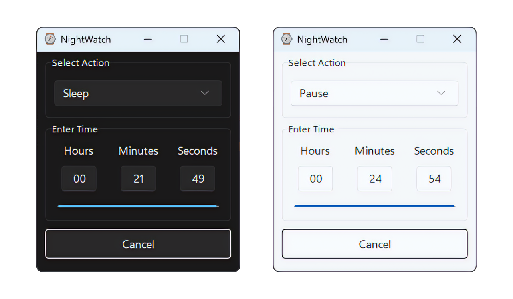

**NightWatch** is a simple app designed to help you create a sleep-friendly environment by managing your devices during bedtime.

## What it does

**Set a sleep timer:** Choose a duration and tell **NightWatch** what to do when the time is up:

- **Pause Media:** Automatically pause your current media playback (e.g. YouTube, Netflix, etc.).
- **Sleep Computer:** Put your computer into sleep mode.
- **Shutdown Computer:** Completely shut down your computer.

## Benefits

- **Prevents wasted power:** Avoids media playback running all night and unnecessary computer usage while you sleep.
- **Promotes restful sleep:** Creates a quiet and undisturbed sleep environment.
- **Simple to use:** Just set the timer and choose the desired action.
- **Dark Theme:** Due to the nature of this app, **NightWatch** defaults to a dark theme, even if the system is set to prefer light. However, if you prefer, you can enable light mode by passing the `--light-mode` or `--light-theme` flag.

**NightWatch** helps you establish a healthier sleep routine by ensuring your devices don't disrupt your rest.

## Preview



## Building from source

**NightWatch** offers two methods for compilation; native compilation and Docker-based compilation. Native compilation requires Python and PyInstaller, while Docker provides pre-configured environments for Windows and Linux.

### Native Compilation

```python
pip install -r requirements.txt
python build.py
```

### Using Docker

Docker simplifies the compilation process by providing ready-to-use environments for both Windows and Linux.

```bash
docker build -t nightwatch-windows-builder -f ./dockerfiles/Dockerfile.windows .

docker run --name nightwatch-windows-builder --volume=$(pwd):/app -d nightwatch-windows-builder
```

**For Linux:**

Follow similar steps as above but replace the Dockerfile name with the appropriate one for Linux.

## License

This project is licensed under the [MIT License](./LICENSE).
